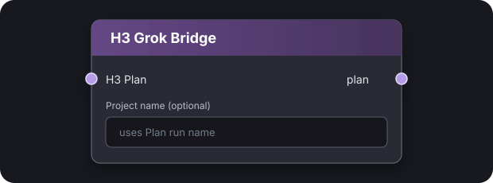

# H3 Grok Bridge

<p align="center">
  
</p>

Edit MiniMax H3 scene prompts with Grok as ordinary Markdown files. Only scene
text comes back into ComfyUI; your Plan structure and generation settings stay
under your control.

## How it works

```text
H3 Plan → H3 Grok Bridge → H3 Scene Prompt Editor
                                  │
                    Grok Send / Grok Pull
                                  │
                         local Markdown files
```

The bridge node stays small. The two working buttons appear in the connected
**H3 Scene Prompt Editor**.

## Install

```bash
cd /path/to/ComfyUI/custom_nodes
git clone https://github.com/ethanfel/ComfyUI-H3-Grok-Bridge.git
ln -s "$PWD/ComfyUI-H3-Grok-Bridge/h3-grok" ~/.local/bin/h3-grok
```

Restart ComfyUI. Add **H3 Grok Bridge** between the Plan and Scene Prompt
Editor. Leave **Project name** blank to use the Plan run name.

### Let Grok learn the commands

```bash
mkdir -p ~/.grok/skills/h3-grok-bridge
cp ComfyUI-H3-Grok-Bridge/.grok/skills/h3-grok-bridge/SKILL.md \
  ~/.grok/skills/h3-grok-bridge/SKILL.md
```

## Use it

1. In the Prompt Editor, click **Grok Send**.
2. Pull the project on the machine where Grok runs:

   ```bash
   h3-grok pull http://127.0.0.1:8188 my_project
   cd my_project
   grok
   ```

3. Ask Grok to edit the scenes. If the skill is installed, `/h3-grok-bridge`
   teaches it to read the project, references, and images.
4. When the edits are ready:

   ```bash
   h3-grok send .
   ```

5. Return to ComfyUI and click **Grok Pull**.

`h3-grok send` stages changes; it does not modify the live Plan. **Grok Pull**
is the explicit approval step.

## What Grok sees

```text
my_project/
├── PROJECT.md          scene list and settings
├── SHARED.md           shared prompt context
├── REFERENCES.md       @tags, #tags, roles and usage
├── assets/             reference images named by tag
│   ├── hero.png
│   └── location.webp
└── scenes/
    ├── 001-intro.md
    ├── 002-hallway.md
    └── 003-outro.md
```

Each scene file contains prompt text only—no JSON and no Markdown header.
Carousel images use their tag as the filename: `@hero` becomes
`assets/hero.png`. Video and audio references are described but not downloaded.

## Safety

- Pull refuses to overwrite unsent local scene edits.
- Pulling again updates imported assets atomically.
- Only scene prompts can be sent back.
- Timing, seeds, policies, assets, and Plan structure remain unchanged.
- `--force` is available only for an intentional local replacement.

## Quick fixes

| Problem | Fix |
|---|---|
| Grok buttons are missing | Wire `Plan → H3 Grok Bridge → Scene Prompt Editor`, then refresh the UI. |
| Project not found | Click **Grok Send** first and use the project name shown in the editor status. |
| New image is missing locally | Click **Grok Send**, then run `h3-grok pull` again. |
| Grok says edits are staged | Click **Grok Pull** in the connected Prompt Editor. |
| Pull protects a local file | Send the edit first, or use `--force` only if you intend to discard it. |

<details>
<summary>Remote ComfyUI and authentication</summary>

Use the reachable ComfyUI URL instead of `127.0.0.1`:

```bash
export COMFYUI_API_TOKEN='...'
h3-grok pull https://comfy.example my_project
h3-grok send my_project
```

The token is never stored in the project folder or workflow. Do not expose an
unauthenticated ComfyUI server directly to the internet.

</details>

Requires [ComfyUI MiniMax H3 Contex Loop](https://github.com/ethanfel/ComfyUI-MiniMaxH3-Contex-Loop).
License: GPL-3.0.
